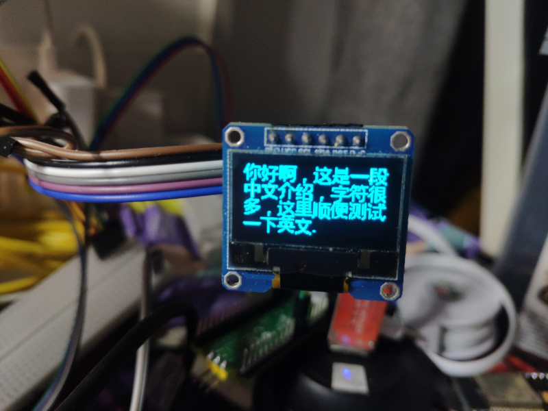

## uart汉字显示器
本项目是汉字显示程序，通过uart协议向设备发送指令，可以直接显示汉字，使用Micropython搭建，列理论上适用于任何Micropython开发版子。

## 所需设备
- Raspberry Pi Pico
- SSD1306屏幕
- usb转ttl
## 文件
.<br/>
├── ChineseFont.py  字体驱动模块<br/>
├── font_16.data    字体文件<br/>
├── img             展示图片<br/>
├── main.py         主函数轮询<br/>
├── readme.MD       readme<br/>
└── Screen.py       屏幕驱动<br/>

## 引脚布局
VBUS -> uart2TTL.V3.3 <br>
GND1 -> uart2TTL.GND <br>
GND2 -> sdd1306.GND <br>
GP0 -> sdd1306.RES <br>
GP1 -> sdd1306.DC <br>

## 依赖项目
自定义字体：[micropython-chinese-font](https://github.com/zhcong/micropython-chinese-font)
SSD1306驱动：[SSD1306-for-ESP32](https://github.com/zhcong/SSD1306-for-ESP32)

## 使用方法
通过uart协议与设备通信，传输utf-8编码的汉字即可，比如链接linux设备，可以使用
```
echo "你好" > /dev/ttyUSB0
```
也可以使用具体的客户端如putty，直接输入设备即可
对于其他嵌入设备，也可以通过uart协议传输需要展示的汉字